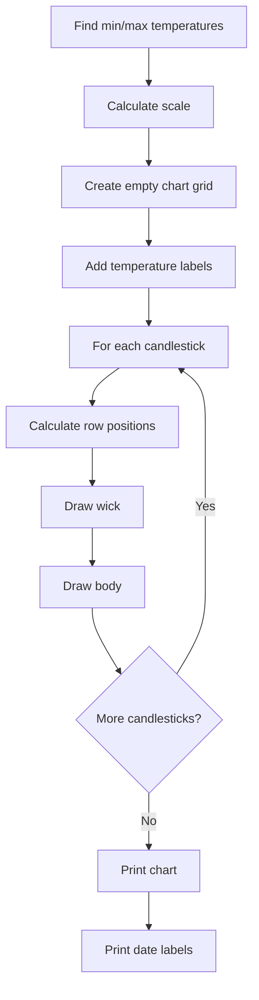

# Task 2: Text-Based Candlestick Plot

This task involves creating a text-based candlestick chart to visualize the computed candlestick data.

## Step 1: Understanding Candlestick Visualization

A candlestick chart represents four key values for each time period:
- **Open**: The starting value (average temperature of the previous period)
- **Close**: The ending value (average temperature of the current period)
- **High**: The highest value during the period
- **Low**: The lowest value during the period

In a traditional candlestick chart:
- The "body" of the candlestick represents the range between Open and Close
- The "wick" or "shadow" extends to the High and Low values
- The body is often filled/colored differently depending on whether Close > Open (up) or Close < Open (down)

Here's what a typical candlestick chart looks like:

```
Temperature
   ^
   |
10 |    │       │
   |    │       │
 9 |    │   ┌───┐
   |    │   │   │
 8 |    ┌───┤   │
   |    │   │   │
 7 |    │   └───┘
   |    │       │
 6 |    │       │
   |    │       │
 5 |    │       │
   |
   +-----------------> Time
      1980    1981
```

In this ASCII representation:
- The vertical line represents the High-Low range (the "wick")
- The box represents the Open-Close range (the "body")
- An empty or differently filled box can indicate whether the temperature rose or fell

## Step 2: Implementing the Plotter Class

The `Plotter` class needs to generate a text-based representation of the candlestick chart. Let's look at the function signature from the header file:

```cpp
// From Plotter.h
static void plotCandlesticks(const std::vector<Candlestick>& candlesticks);
```

### Visualization Algorithm

To implement this function, you'll need to:

1. Find the minimum and maximum temperatures across all candlesticks
2. Determine the chart dimensions and scale
3. Create a 2D grid to represent the chart
4. For each candlestick:
   - Calculate the row positions for Open, Close, High, and Low
   - Draw the vertical wick from High to Low
   - Draw the body from Open to Close with appropriate characters
5. Add temperature labels on the left axis
6. Add date labels at the bottom

Here's a visual representation of the process:



### Chart Scaling

The key to a good visualization is proper scaling. You'll need to map temperature values to row positions in your chart:

```
Row position = (maxTemp - temperature) / tempPerRow
```

Where:
- `maxTemp` is the highest temperature in your dataset
- `tempPerRow` is the temperature range represented by each row
- The result is the row index from the top of the chart

### Example Chart Structure

Here's how you might structure your chart:

```
10.0 |                        
 9.5 |    │       │           
 9.0 |    │   ┌───┐           
 8.5 |    │   │   │           
 8.0 |    ┌───┤   │           
 7.5 |    │   │   │           
 7.0 |    │   └───┘           
 6.5 |    │       │           
 6.0 |    │       │           
-----+------------------------
     |  1980    1981    1982  
```

## Alternative Simple Table Approach

If the ASCII art approach is challenging, you can start with a simpler tabular representation:

```
Date   | Open | Close | High | Low  | Trend
-------|------|-------|------|------|------
1980   | 7.5  | 8.2   | 9.1  | 6.3  | UP
1981   | 8.2  | 7.1   | 9.0  | 6.5  | DOWN
1982   | 7.1  | 7.8   | 8.7  | 6.2  | UP
```

This approach is easier to implement and still provides all the essential information.

## Implementation Tips

1. **Start Simple**: Begin with a basic implementation and gradually enhance it
2. **Handle Edge Cases**: Check for empty input and ensure proper bounds checking
3. **Use Constants**: Define chart dimensions as constants for easy adjustment
4. **Test Incrementally**: Test with small datasets first to verify your visualization logic

## Key Points for Task 2

1. **Chart Scaling**:
   - Determine the temperature range (min to max)
   - Calculate the vertical scale (temperature per row)
   - Map temperature values to row positions

2. **Candlestick Representation**:
   - Use '|' for the wick (High to Low)
   - Use characters like '+', '#', or '█' to fill the body
   - Use different characters for up trends vs. down trends

3. **Chart Layout**:
   - Include a temperature axis on the left
   - Include date labels at the bottom
   - Ensure proper spacing between candlesticks

4. **Simplification Options**:
   - Start with a tabular representation if ASCII art is challenging
   - Gradually enhance the visualization as you progress

## Navigation

- [Back to Project Overview](index.html)
- [Previous: Task 1 - Computing Candlestick Data](task1.html)
- [Next: Task 3 - Filtering Data](task3.html)
