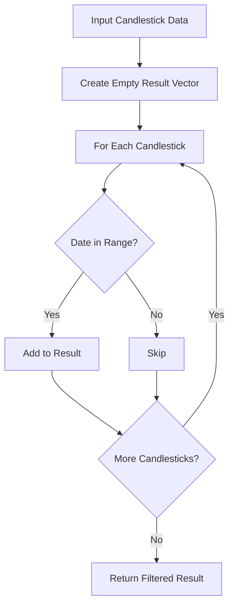
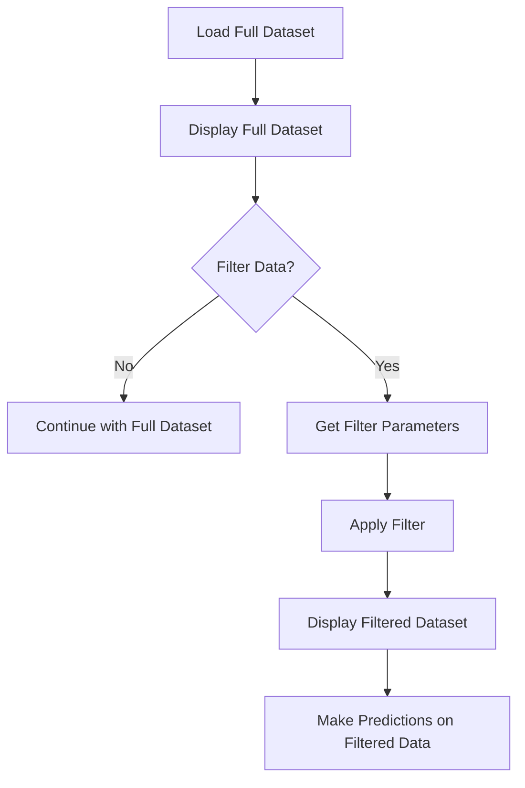

# Task 3: Filtering Data

This task involves implementing filters to allow users to focus on specific subsets of the data.

## Understanding Data Filtering

Filtering is a crucial aspect of data analysis that allows users to:
- Focus on specific time periods of interest
- Identify trends within particular date ranges
- Compare different periods more effectively
- Reduce visual clutter in charts

## Step 1: Implementing the DataFilter Class

The `DataFilter` class provides methods to filter candlestick data based on various criteria. Let's look at the function signature from the header file:

```cpp
// From DataFilter.h
static std::vector<Candlestick> filterByDateRange(
    const std::vector<Candlestick>& data, 
    const std::string& startDate, 
    const std::string& endDate);
```

### Date Range Filtering Algorithm

To implement this function, you'll need to:

1. Create an empty result vector to store filtered candlesticks
2. Iterate through the input data vector
3. For each candlestick, check if its date is within the specified range
4. If it is, add it to the result vector
5. Return the filtered result

Here's a visual representation of the filtering process:



### Date Comparison

Since dates are in "YYYY-MM-DD" format, you can use string comparison operators:
- `>=` to check if a date is after or equal to the start date
- `<=` to check if a date is before or equal to the end date

For example:
```cpp
if (candlestick.getDate() >= startDate && candlestick.getDate() <= endDate) {
    // Date is within range
}
```

## Step 2: Adding User Interaction for Filtering

To make your application more interactive, you can enhance the main function to allow users to specify filter criteria. Here's how you might structure this:

1. Load and display the full dataset first
2. Ask the user if they want to filter the data
3. If yes, prompt for filter parameters (e.g., start and end years)
4. Apply the filter and display the filtered results
5. Use the filtered data for predictions

Here's a flowchart of the user interaction:



## Step 3: Implementing Additional Filters (Optional)

You can extend the `DataFilter` class with additional filtering methods. Here are some ideas:

### Temperature Range Filter

Filter candlesticks based on temperature values:
```cpp
// Possible function signature
static std::vector<Candlestick> filterByTemperatureRange(
    const std::vector<Candlestick>& data, 
    double minTemp, 
    double maxTemp);
```

### Trend Filter

Filter candlesticks based on whether they show an upward or downward trend:
```cpp
// Possible function signature
static std::vector<Candlestick> filterByTrend(
    const std::vector<Candlestick>& data, 
    bool upwardTrend);
```

### Volatility Filter

Filter candlesticks based on their volatility (difference between high and low):
```cpp
// Possible function signature
static std::vector<Candlestick> filterByVolatility(
    const std::vector<Candlestick>& data, 
    double minVolatility);
```

## Implementation Tips

1. **Error Handling**: Validate filter parameters to ensure they're valid
2. **Empty Results**: Handle the case where no candlesticks match the filter criteria
3. **Combining Filters**: Consider how multiple filters could be applied sequentially
4. **User Feedback**: Provide clear information about how many items were filtered

## Key Points for Task 3

1. **Date Range Filtering**:
   - Use string comparison for dates in "YYYY-MM-DD" format
   - Ensure the filter range is valid within the loaded data range

2. **User Interaction**:
   - Allow users to specify filter criteria
   - Validate user input to prevent errors
   - Provide clear feedback about the applied filters

3. **Additional Filters**:
   - Consider implementing filters based on temperature range
   - Consider implementing filters based on trend (up or down)
   - Combine multiple filters for more specific analysis

4. **Integration with Other Components**:
   - Apply filters before plotting to show only the relevant data
   - Use filtered data for predictions to focus on specific periods

## Navigation

- [Back to Project Overview](index.html)
- [Previous: Task 2 - Text-Based Candlestick Plot](task2.html)
- [Next: Task 4 - Prediction Models](task4.html)
