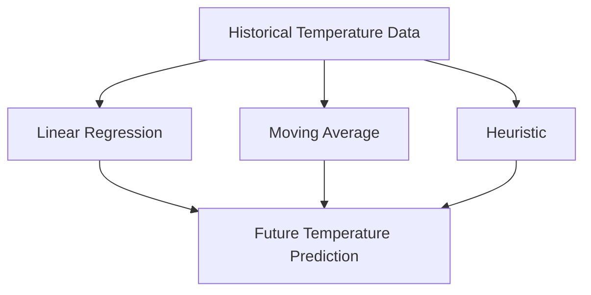

# Task 4: Prediction Models

This task involves implementing prediction models to forecast future temperature trends based on historical data.

## Understanding Prediction Models

Prediction models use historical data to forecast future values. In this project, you'll implement three different models, each with its own strengths and characteristics:



## Step 1: Understanding the Prediction Models

### 1. Linear Regression Model

Linear regression fits a straight line through the data points that minimizes the sum of squared errors:

```
y = mx + b
```

Where:
- `y` is the predicted temperature
- `x` is the time index
- `m` is the slope (rate of change)
- `b` is the y-intercept (base value)

The least squares method calculates `m` and `b` using these formulas:

```
m = (n*Σ(xy) - Σx*Σy) / (n*Σ(x²) - (Σx)²)
b = (Σy - m*Σx) / n
```

Where:
- `n` is the number of data points
- `Σ` means "sum of"
- `x` is the time index (0, 1, 2, ...)
- `y` is the temperature value (Close value of each candlestick)

Here's a visual representation of linear regression:

```
Temperature
   ^
   |                                 *
   |                        *
   |                *
   |        *
   |  *
   +---------------------------------> Time
      1980    1990    2000    2010    2020
```

### 2. Moving Average Model

The moving average model predicts the next value by averaging the last `n` values:

```
prediction = (y₁ + y₂ + ... + yₙ) / n
```

Where:
- `y₁, y₂, ..., yₙ` are the last `n` temperature values
- `n` is the window size (e.g., 3 for a 3-period moving average)

Here's a visual representation of a moving average:

```
Temperature
   ^
   |        Raw data: *
   |        Moving average: o
   |                 *
   |        *      o      *
   |  *    o o    *
   |    o*    o*o
   +---------------------------------> Time
```

### 3. Heuristic-Based Model

The heuristic model uses a simple rule of thumb: assume the next change will be similar to the last change:

```
prediction = last + (last - secondLast)
```

Where:
- `last` is the most recent temperature value
- `secondLast` is the second most recent temperature value

This model essentially projects the recent trend forward:

```
Temperature
   ^
   |                                /
   |                          *   /
   |                     *   /
   |                *   /
   |           *   /
   +---------------------------------> Time
                      Projection -->
```

## Step 2: Implementing the Prediction Class

Let's look at the function signatures from the header file:

```cpp
// From Prediction.h
static double predictLinear(const std::vector<Candlestick>& data);
static double predictMovingAverage(const std::vector<Candlestick>& data, int windowSize = 3);
static double predictHeuristic(const std::vector<Candlestick>& data);
```

### Linear Regression Implementation

To implement the linear regression model:

1. Check if there's enough data (at least 2 points for a meaningful regression)
2. Calculate the sums needed for the least squares formula (Σx, Σy, Σxy, Σx²)
3. Calculate the slope (m) and intercept (b)
4. Predict the next value using y = mx + b, where x is the next time index

### Moving Average Implementation

To implement the moving average model:

1. Determine the actual window size (use the minimum of the requested window size and available data points)
2. Sum the closing values for the last `windowSize` periods
3. Divide the sum by the window size to get the average

### Heuristic Implementation

To implement the heuristic model:

1. Check if there's enough data (at least 2 points to calculate a change)
2. Get the last and second-to-last closing values
3. Calculate the last change (last - secondLast)
4. Predict that the same change will happen again (last + change)

## Step 3: Evaluating and Comparing Prediction Models

After implementing the prediction models, you should evaluate and compare their results:

1. Apply each model to the same dataset
2. Display the predictions side by side
3. Compare the results and discuss their implications

Here's how you might structure the comparison:

```
Predictions for next period:
Linear model: 8.7°C
Moving Average: 8.2°C
Heuristic: 9.1°C

The heuristic model predicts the highest temperature,
suggesting a recent upward trend in the data.
```

You could also implement a simple evaluation mechanism to determine which model might be most appropriate for the current dataset.

## Implementation Tips

1. **Handle Edge Cases**: Check for empty data or insufficient data points
2. **Numerical Stability**: Be careful with division operations (check for zero denominators)
3. **Model Validation**: Consider implementing a way to validate model accuracy using historical data
4. **Error Handling**: Provide meaningful fallbacks when predictions cannot be computed

## Key Points for Task 4

1. **Linear Regression Model**:
   - Suitable for identifying long-term trends
   - More reliable with larger datasets
   - Captures the overall direction of temperature change

2. **Moving Average Model**:
   - Good for smoothing out short-term fluctuations
   - More conservative prediction that doesn't overreact to recent changes
   - Typically works well for stable or cyclical data

3. **Heuristic Model**:
   - Simple and intuitive approach
   - Assumes recent momentum will continue
   - Can be volatile if the last period had an unusual change

4. **Model Comparison**:
   - Compare predictions from different models to assess uncertainty
   - Consider the characteristics of the data when interpreting results
   - Provide context for the predictions (e.g., confidence level, potential factors)

5. **Error Handling**:
   - Handle edge cases (empty data, single data point)
   - Validate inputs to prediction functions
   - Provide meaningful fallbacks when predictions cannot be computed

## Conclusion

This implementation guide provides a comprehensive approach to building the Weather Data Analysis and Prediction project. By following the steps outlined for each task, you will create a functional application that:

1. Processes temperature data from CSV files
2. Computes meaningful candlestick metrics
3. Visualizes the data through text-based charts
4. Allows filtering to focus on specific subsets of data
5. Predicts future temperature trends using multiple models

The modular design of the project allows for easy extension and enhancement. You can add more sophisticated prediction models, implement additional filters, or improve the visualization as you become more comfortable with the codebase.

Remember to test your implementation thoroughly with different datasets and edge cases to ensure robustness and accuracy.

## Navigation

- [Back to Project Overview](index.html)
- [Previous: Task 3 - Filtering Data](task3.html)
